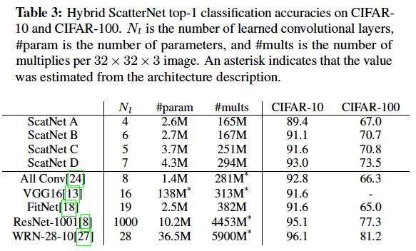
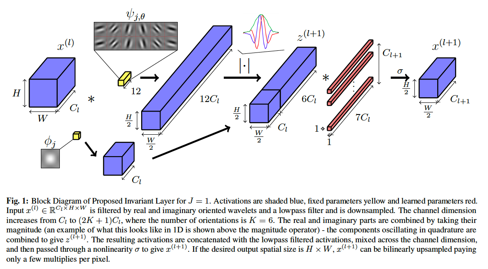

The Learnable ScatterNet
========================

This repo implements the network described in the paper `A Learnable ScatterNet:
Locally Invariant Convolutional Layers`__. In particular, it is a way to
replicate the results from Table 3 using PyTorch:

The learnable ScatterNet is a DTCWT based scatternet. It differs from the
original translation invariant scatternet introduced in `Invariant Scattering
Convolution Networks`__ by adding a learned mixing layer between the scattering
orders. To do this we've programmed a differentiable scatternet, allowing us to
pass gradients through scattering layers. Additionally, because it is based on
the DTCWT, we are restricted in the number of orientations we can use in the
Scattering. For more information see the paper.

The results in the table above highlight the benefits of our implementation.
ScatterNets A is the original translation invariant scatternet before a 4 layer
convolutional network. ScatterNet B introduces the learned mixing matrices in
between scattering orders. ScatterNet C is again the original translation
invariant scatternet but with a learned convolutional layer *before* it and
ScatterNet D has a learned layer before and in between scattering orders.

A block diagram of what we're doing is shown below (Figure 1 from the paper).

__ https://arxiv.org/abs/1811.06115
__ https://arxiv.org/abs/1203.1513 

Installation
------------
This repo uses my pytorch implementation of the dtcwt: `pytorch_wavelets`__. You
can install this however just by pip installing the requirements.txt. From the
command line, the following 3 commands will allow you to run the experiments:

.. code:: 

    git clone https://github.com/fbcotter/scatnet_learn
    pip install -r requirements.txt
    pip install .

__ https://github.com/fbcotter/pytorch_wavelets

Running Experiments
-------------------
The whole suite of tests to create Table 1 can be run by running the
`experiments/paper_experiments.py` file. Note that this is written to work on a multi-gpu
system, and loads each gpu with different nets - i.e. it is very intensive and
can take several hours to run. It is recommended to try to run individual nets
first.

Development and Expansion
-------------------------
The code is designed to be reusable, so you can design your own networks using
the original ScatNet or Learnable ScatNet layers. For example, if you wanted to
create a standard DTCWT ScatterNet frontend with no learned mixing, you can with
the following code:

.. code:: python

    from scatnet_learn import ScatLayer
    import torch.nn as nn
    from collections import OrderedDict
    C = 3
    # A standard scatlayer expands the channel input from C to 7C - one 
    # lowpass and 6 oriented bandpass.
    frontend = nn.Sequential(OrderedDict([
                ('order1', ScatLayer(C)),
                ('order2', ScatLayer(7*C))]))
    x = torch.randn(1,C,64,64)
    y = frontend(x)
    y.shape
    >>> (1, 147, 16, 16)

If you want to use the proposed expansions from the paper, you can with:

.. code:: python

    frontend = nn.Sequential(OrderedDict([
                ('order1', ScatLayer(C, learn=True)),
                ('order2', ScatLayer(7*C, learn=True))]))

By default the mixing matrix will preserve the translation invariant scatternet
tendency to increase the channel dimension by 7. However, if you want to change
the number of output channels you can:

.. code:: python
    
    C = 3
    frontend = nn.Sequential(OrderedDict([
                ('order1', ScatLayer(C, F=7*C, learn=True)),
                ('order2', ScatLayer(7*C, F=7*C, learn=True))]))
    x = torch.randn(1,C,64,64)
    y = frontend(x)
    y.shape
    >>> (1, 21, 16, 16)
